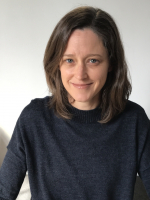
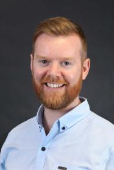

Dr Kathleen Falster \
Senior Lecturer | Seeding Success study director
 \
School of Population Health, UNSW Sydney \
T: +61 2 9065 9652 \
E: k.falster@unsw.edu.au \
W: [https://research.unsw.edu.au/people/dr-kathleen-falster](https://research.unsw.edu.au/people/dr-kathleen-falster){target="_blank"}

<aside>
{width=60%}
</aside>

 

Dr Mark Hanly \
Lecturer | Seeding Successs lead statistican
 \
Centre for Big Data Research in Health, UNSW Sydney \
T: +61 2 9385 3143 \
E: m.hanly@unsw.edu.au \
W: [https://cbdrh.med.unsw.edu.au/people/mr-mark-hanly](https://cbdrh.med.unsw.edu.au/people/mr-mark-hanly){target="_blank"}

<aside>
{width=60%}
</aside>

_This website was built using [Distill for R Markdown](https://rstudio.github.io/distill/){target="_blank"}. The source code is available online at [https://github.com/SeedingSuccess/SeedingSuccess.github.io](https://github.com/SeedingSuccess/SeedingSuccess.github.io){target="_blank"}. Errors or omissions on this website can be logged using GitHub issues [here](https://github.com/SeedingSuccess/SeedingSuccess.github.io/issues){target="_blank"}._