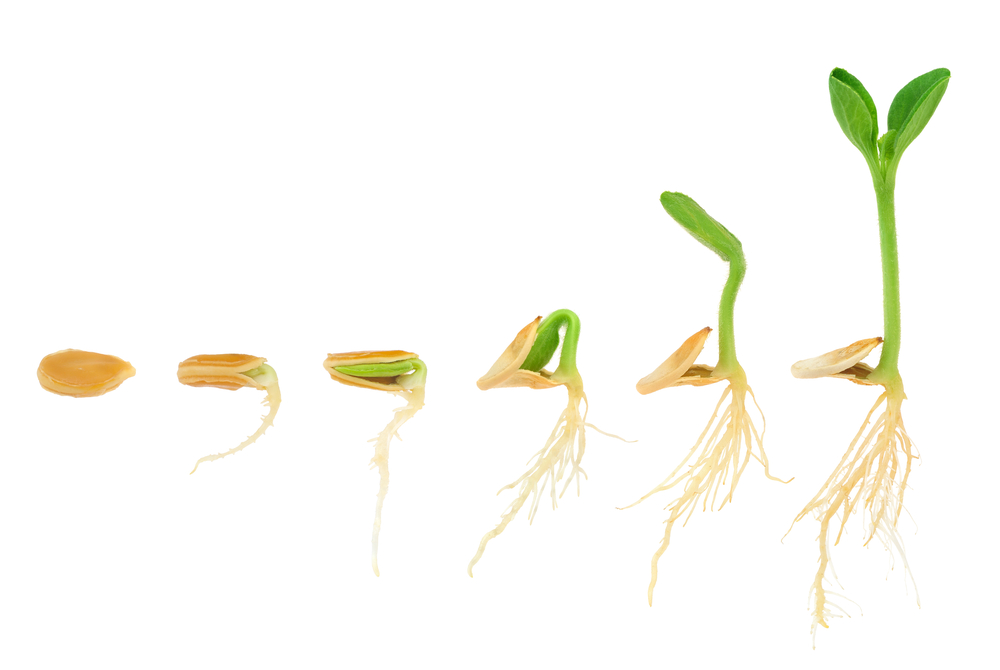

```{r setup, include=FALSE}
knitr::opts_chunk$set(echo = FALSE)

# Learn more about creating websites with Distill at:
# https://rstudio.github.io/distill/website.html

# Learn more about publishing to GitHub Pages at:
# https://rstudio.github.io/distill/publish_website.html#github-pages

```



## Overview
The Seeding Success study data resource was established to conduct child health and health equity research in Australia’s most populous state, New South Wales, with a focus on Aboriginal and Torres Strait Islander children and scope to investigate multiple dimensions of disadvantage.

The data resource comprised individual-level administrative data with comprehensive population coverage, routinely collected by several sectors (including health, education and community services), that were linked together to construct the health and development trajectories of a large, population-based cohort of children from birth to school age. This website summarises research outputs from the Seeding Success study (2013-2021). 
