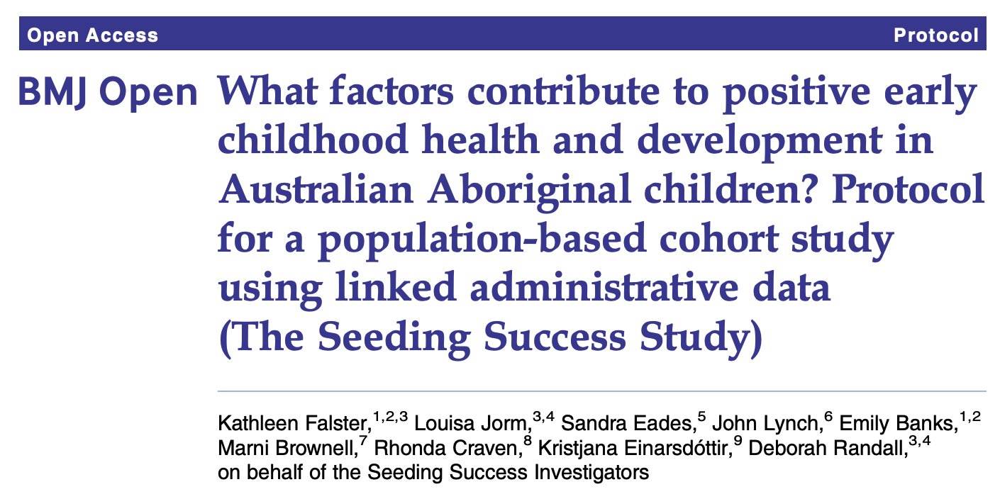
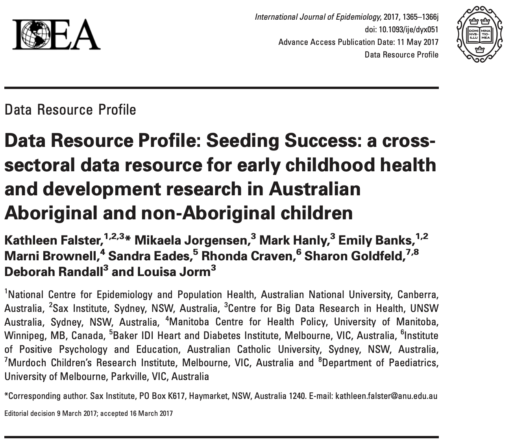
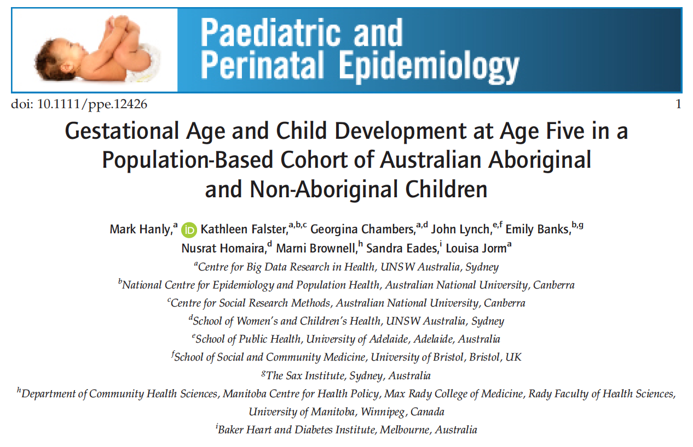
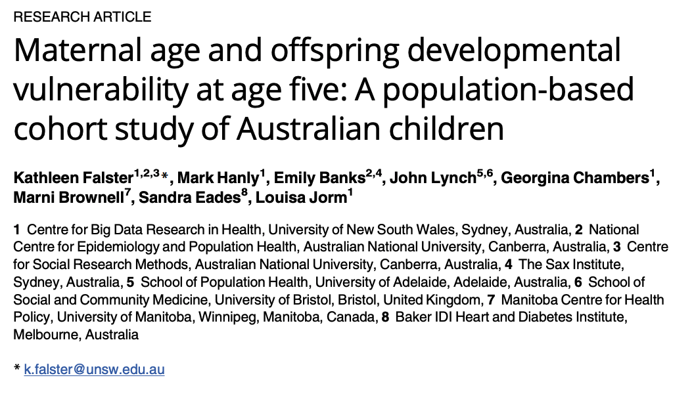
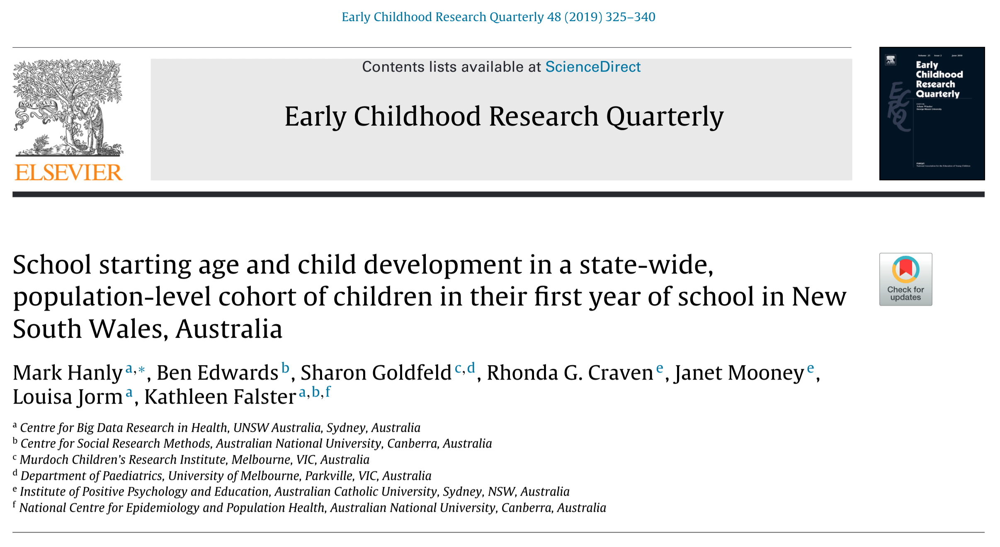
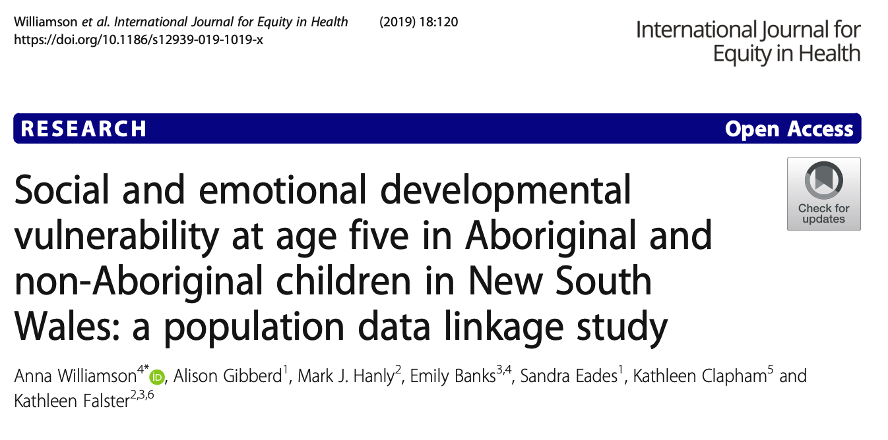
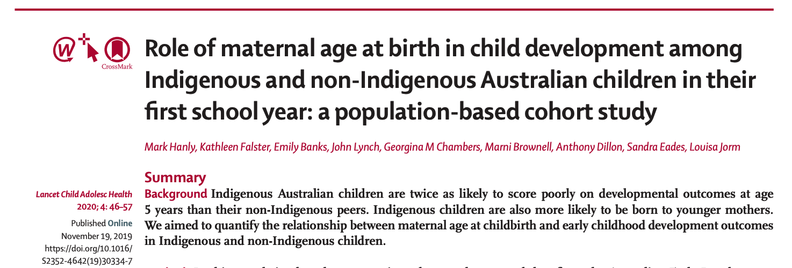
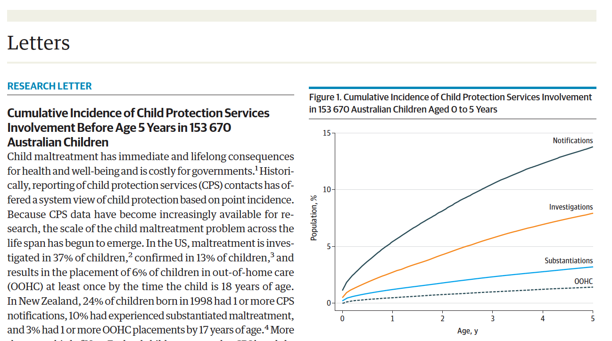
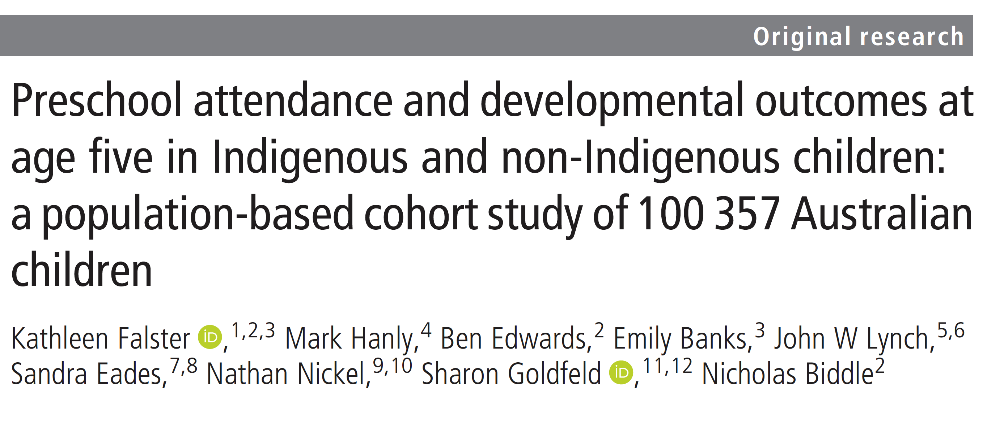

_If you are unable to download any of the listed publications through the links below please [Contact us](/contact.html) and we will be able to provide you with a PDF copy._

### What factors contribute to positive early childhood health and development in Australian Aboriginal children? Protocol for a population-based cohort study using linked administrative data (The Seeding Success Study)

<aside>
[{width=200%}](http://dx.doi.org/10.1136/bmjopen-2015-007898){target="_blank"}
</aside>

#### Cite this article
Falster K, Jorm L, Eades S, Lynch J, Banks E, Brownell M, Craven R, Einarsdóttir K, Randall D. What factors contribute to positive early childhood health and development in Australian Aboriginal children? Protocol for a population-based cohort study using linked administrative data (The Seeding Success Study). _BMJ Open_. 2015 May 1;5(5).

#### DOI
[http://dx.doi.org/10.1136/bmjopen-2015-007898](http://dx.doi.org/10.1136/bmjopen-2015-007898){target="_blank"}

***
 
### Data Resource Profile: Seeding Success: a cross-sectoral data resource for early childhood health and development research in Australian Aboriginal and non-Aboriginal children

<aside>
[{width=200%}](https://doi.org/10.1093/ije/dyx051){target="_blank"}
</aside>

#### Cite this article
Falster K, Jorgensen M, Hanly M, Banks E, Brownell M, Eades S, Craven R, Goldfeld S, Randall D, Jorm L. Data Resource Profile: Seeding Success: A cross-sectoral data resource for early childhood health and development research in Australian Aboriginal and non-Aboriginal children. _International Journal of Epidemiology_. 2017 Oct 1;46(5):1365-6j.

#### DOI
[https://doi.org/10.1093/ije/dyx051](https://doi.org/10.1093/ije/dyx051){target="_blank"}

*** 

### Gestational Age and Child Development at Age Five in a Population‐Based Cohort of Australian Aboriginal and Non‐Aboriginal Children

<aside>
[{width=200%}](https://doi.org/10.1111/ppe.12426){target="_blank"}
</aside>

#### Cite this article
Hanly M, Falster K, Chambers G, Lynch J, Banks E, Homaira N, Brownell M, Eades S, Jorm L. Gestational age and child development at age five in a population‐based cohort of Australian Aboriginal and non‐aboriginal children. _Paediatric and Perinatal Epidemiology_. 2018 Jan;32(1):114-25.

<aside>

#### Commentary on this paper
[Anderson PJ. Classifying High-risk Children Born Preterm. _Paediatric and Perinatal Epidemiology_. 2018 Jan;32(1)](https://onlinelibrary.wiley.com/doi/full/10.1111/ppe.12440){target="_blank"}

</aside>

#### DOI
[https://doi.org/10.1111/ppe.12426](https://doi.org/10.1111/ppe.12426){target="_blank"}

*** 

### Maternal age and offspring developmental vulnerability at age five: A population-based cohort study of Australian children

<aside>
[{width=200%}](https://doi.org/10.1371/journal.pmed.1002558){target="_blank"}
</aside>

#### Cite this article
Falster K, Hanly M, Banks E, Lynch J, Chambers G, Brownell M, Eades S, Jorm L. Maternal age and offspring developmental vulnerability at age five: A population-based cohort study of Australian children. _PLoS Medicine_. 2018 Apr 24;15(4):e1002558.

<aside>
[Media coverage](/media.html#Maternal-age-and-offspring-developmental-vulnerability-at-age-five){target="_blank"}
</aside>

#### DOI
[https://doi.org/10.1371/journal.pmed.1002558](https://doi.org/10.1371/journal.pmed.1002558){target="_blank"}

*** 

### School starting age and child development in a state-wide, population-level cohort of children in their first year of school in New South Wales, Australia

<aside>
[{width=200%}](https://doi.org/10.1016/j.ecresq.2019.01.008){target="_blank"}
</aside>

#### Cite this article
Hanly M, Edwards B, Goldfeld S, Craven RG, Mooney J, Jorm L, Falster K. School starting age and child development in a state-wide, population-level cohort of children in their first year of school in New South Wales, Australia. _Early Childhood Research Quarterly_. 2019 Jul 1;48:325-40.

<aside>
#### Companion piece on this article
[Which families delay sending their child to school, and why? We crunched the numbers.](https://theconversation.com/which-families-delay-sending-their-child-to-school-and-why-we-crunched-the-numbers-111826){target="_blank"} published in The Conversation on 9 April 2019.
</aside>

#### DOI
[https://doi.org/10.1016/j.ecresq.2019.01.008](https://doi.org/10.1016/j.ecresq.2019.01.008){target="_blank"}

<aside>
[Media coverage](/media.html#school-starting-age-and-child-development){target="_blank"}
</aside>

***

### Social and emotional developmental vulnerability at age five in Aboriginal and non-Aboriginal children in New South Wales: a population data linkage study

<aside>
[{width=200%}](https://doi.org/10.1186/s12939-019-1019-x){target="_blank"}
</aside>

#### Cite this article
Williamson A, Gibberd A, Hanly MJ, Banks E, Eades S, Clapham K, Falster K. Social and emotional developmental vulnerability at age five in Aboriginal and non-Aboriginal children in New South Wales: a population data linkage study. _International Journal for Equity in Health_. 2019 Dec 1;18(1):120.

#### DOI
[https://doi.org/10.1186/s12939-019-1019-x](https://doi.org/10.1186/s12939-019-1019-x){target="_blank"}

***

### Role of maternal age at birth in child development among Indigenous and non-Indigenous Australian children in their first school year: a population-based cohort study

<aside>
[{width=200%}](https://doi.org/10.1016/S2352-4642(19)30334-7){target="_blank"}
</aside>

#### Cite this article 
Hanly M, Falster K, Banks E, Lynch J, Chambers GM, Brownell M, Dillon A, Eades S, Jorm L. Role of maternal age at birth in child development among Indigenous and non-Indigenous Australian children in their first school year: a population-based cohort study. _The Lancet Child & Adolescent Health_. 2020 Jan 1;4(1):46-57.

<aside>

#### Commentary on this paper
[Brown SJ. Disparities in outcomes for Indigenous children. _The Lancet Child & Adolescent Health_. 2020 Jan 1;4(1)](https://doi.org/10.1016/S2352-4642(19)30324-4){target="_blank"}

</aside>

#### DOI
[https://doi.org/10.1016/S2352-4642(19)30334-7](https://doi.org/10.1016/S2352-4642(19)30334-7){target="_blank"}

***

### Cumulative Incidence of Child Protection Services Involvement Before Age 5 Years in 153 670 Australian Children

<aside>
[{width=200%}](https://doi.org/10.1001/jamapediatrics.2020.1151){target="_blank"}
</aside>

#### Cite this article 
Falster K, Hanly M, Pilkington R, Eades S, Stewart J, Jorm L, Lynch J. Cumulative Incidence of Child Protection Services Involvement Before Age 5 Years in 153 670 Australian Children. _JAMA Pediatrics_. 2020 Oct 1;174(10):995-7.

<aside>
[Media coverage](/media.html#cumulative-incidence-of-child-protection-services-involvement){target="_blank"}
</aside>

#### DOI
[https://doi.org/10.1001/jamapediatrics.2020.1151](https://doi.org/10.1001/jamapediatrics.2020.1151){target="_blank"}

***

### Preschool attendance and developmental outcomes at age five in Indigenous and non-Indigenous children: a population-based cohort study of 100 357 Australian children

<aside>
[{width=200%}](http://dx.doi.org/10.1136/jech-2020-214672){target="_blank"}
</aside>

#### Cite this article
Falster K, Hanly M, Edwards B, Banks E, Lynch JW, Eades S, Nickel N, Goldfeld S, Biddle N. Preschool attendance and developmental outcomes at age five in Indigenous and non-Indigenous children: a population-based cohort study of 100 357 Australian children. J Epidemiol Community Health. 2020 Dec 4.

<aside>

#### Companion piece on this article
[Preschool benefits Indigenous children more than other types of early care](https://theconversation.com/preschool-benefits-indigenous-children-more-than-other-types-of-early-care-149724){target="_blank"} published in The Conversation on 9 December 2020.

</aside>

#### DOI
[http://dx.doi.org/10.1136/jech-2020-214672](http://dx.doi.org/10.1136/jech-2020-214672){target="_blank"}

