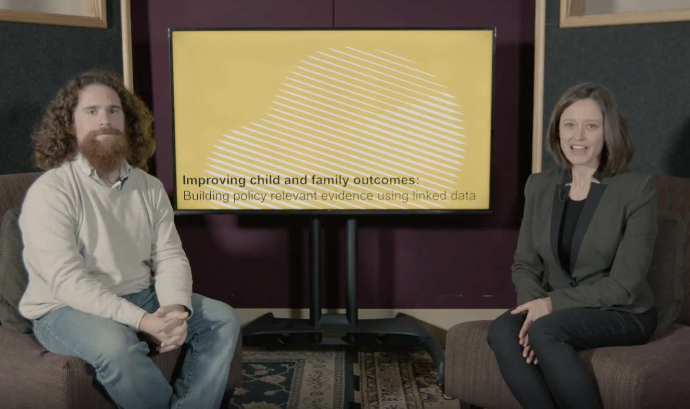
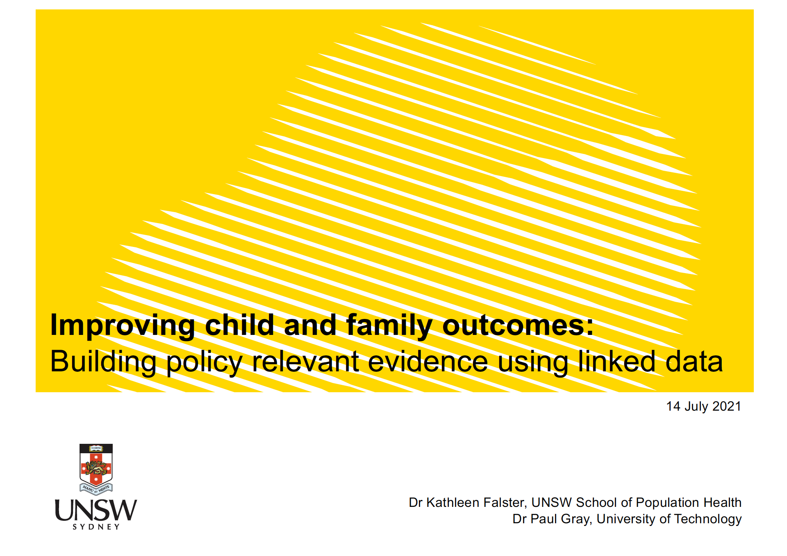

From https://www.facs.nsw.gov.au/resources/research/seminars/chapters/july-2020-dcj-research-strategy-webinar:

>On 14 July 2021, the Family and Community Services Insights, Analysis and Research (FACSIAR) from the NSW Department of Communities and Justice hosted a DCJ Research Strategy webinar with an introduction from Secretary Michael Coutts Trotter.
Guest speakers include Dr Kathleen Falster, Senior Lecturer at the UNSW School of Population Health and Associate Professor Paul Gray from the Jumbunna Institute for Indigenous Education and Research at the University of Technology, Sydney.

* Watch a recording of the webinar presentation <a href="https://macs1macsprodv3.intelligencebank.com/cdn/facs/share/vkyW/k780K/NJNB2/mp4/DCJ+HSDS+%26+POCLS+-+kathleen+%26+paul-v3" target="_blank">'Improving child and family outcomes: Building policy relevant evidence using linked data'</a> by Dr Kathleen Falster and Associate Professor Paul Gray.

<aside>
[{width=200%}](https://macs1macsprodv3.intelligencebank.com/cdn/facs/share/vkyW/k780K/NJNB2/mp4/DCJ+HSDS+%26+POCLS+-+kathleen+%26+paul-v3){target="_blank"}
</aside>

 

* Download the [presentation slides](https://www.facs.nsw.gov.au/download?file=814057).

<aside>
[{width=200%}](https://www.facs.nsw.gov.au/download?file=814057){target="_blank"}
</aside>